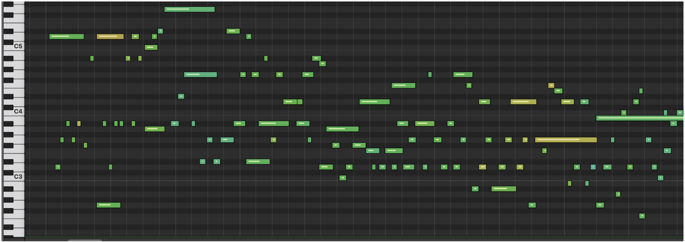
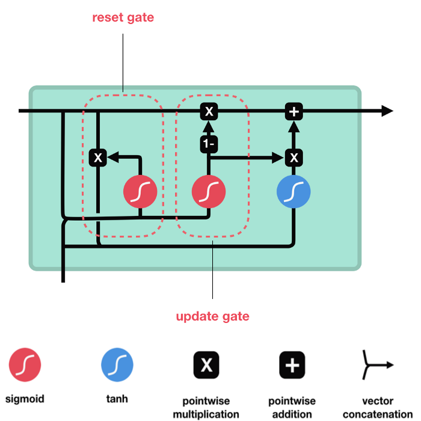

# Amadeus

[](https://opensource.org/licenses/MIT)

A music generation and model compression project using PyTorch and [Distiller](https://nervanasystems.github.io/distiller/).

<p align="center">
  
</p>

## Repo Structure

```
.
├── dataset/
│   ├── midi/
│   │   ├── dataset1/
│   │   │   └── *.mid
│   │   └── dataset2/
│   │       └── *.mid
│   ├── processed/
│   │   └── dataset1/
│   │       └── *.data (preprocess.py)
│   └── scripts/
│       └── *.sh (dataset download scripts)
├── images/
│   └── *.png
├── input/
│   └── *.mid (generate.py)
├── output/
│   └── *.mid (generate.py)
├── save/
│   └── *.sess (train.py)
├── stats/
│   └── *.yaml (quantize.py)
├── tests/
│   └── *.py
├── runs/ (tensorboard logdir)
```

## Amadeus

Amadeus is a tool for musicians to break through creative blocks. Suppose you have a musical idea in mind, but you don't know how to complete it. With Amadeus, you can connect a MIDI device (e.g., an electric keyboard) to your laptop or mobile device, play an input phrase of music, and hear the musical response of an AI trained on classical repertoire.

Amadeus creates music with Performance RNN, a model for real-time music generation. I use a model compression technique known as [post-training weight quantization](https://nervanasystems.github.io/distiller/quantization.html) to shrink the size of the original model by a factor of four with only a marginal loss in output quality.

## Performance RNN

Performance RNN is designed to capture the nuances of human musical performance and to generate musical output in real time. It uses a recurrent neural network (RNN) architecture known as gated recurrent units (GRUs) to model sequences of so-called "note events", of which there are four kinds:

- Note-on events, which represent the start of a pitch,
- Note-off events, which represent the end of a pitch,
- Velocity events, which control the volume at which a pitch is played,
- Time events, which move forward in time to the next note event.

<p align="center">
  
</p>
<p align="center">
  <em>A visual representation of note events.</em>
</p>

This representation of music has several advantages. First, it allows Performance RNN to model "polyphonic" music -- music in which more than one pitch is played at a single time. Second, it captures the nuances of musical performances, e.g., subtle changes in dynamics or rhythm.

Performance RNN is trained on musical data in MIDI format. MIDI, which stands for "musical instrument digital interface", provides a lightweight representation of music and easily interfaces with digital instruments such as electric keyboards and electric guitars. Notable MIDI datasets for classical piano music include the [e-Piano Competition Dataset](http://www.piano-e-competition.com/) and the [MAESTRO Dataset](https://magenta.tensorflow.org/datasets/maestro) (use the scripts in `dataset/scripts/` for downloading these and other MIDI datasets).

Performance RNN was originally implemented in TensorFlow as a [Google Magenta project](https://magenta.tensorflow.org/performance-rnn), but Amadeus is built upon a [PyTorch re-implementation](https://github.com/djosix/Performance-RNN-PyTorch).


## Post-Training Weight Quantization

Post-training weight quantization is a model compression technique that leverages pre-trained weights to produce a model of reduced size with a marginal loss in performance. The weights of a typical PyTorch tensor are 32-bit floats. In post-training quantization, we map pre-trained weights _x<sub>f</sub>_ into a specified integer range (e.g., between -2<sup>7</sup> and 2<sup>7</sup> - 1 in the graphic below) and then convert the weights to 8-bit integers. This reduces the model to 1/4 of the original size and also increases inference speed, since operations on 8-bit integers are faster than operations on 32-bit floats. In practice, 8-bits has been found to be the lowest precision that does not severely impact performance without re-training, although it is possible to use further techniques such as [quantization-aware training](https://nervanasystems.github.io/distiller/quantization.html#aggressive-quantization-int4-and-lower) to reduce the precision of the weights even further.

<p align="center">
  
</p>
<p align="center">
  <em>One possible mapping of 32-bit float weights into an integer range of length 2<sup>8</sup>.</em>
</p>

To find an appropriate mapping from the original 32-bit float weights of a tensor to the quantized integer weights, we collect statistics on the values of the input tensor during the forward pass of actual data through the model. There are several maps that could be developed from these statistics, but Amadeus uses an asymmetric range-based mapping with average clipping, the details of which can be found [here](https://nervanasystems.github.io/distiller/algo_quantization.html).

Amadeus uses [Distiller](https://nervanasystems.github.io/distiller/), an open-source Python package for model compression, to quantize Performance RNN. At this time, Distiller does not support weight quantization of the gated recurrent units (GRUs) found in Performance RNN. To overcome this challenge, I built a sub-module within my [forked Distiller repository](https://github.com/axiom-of-joy/distiller) for quantizing GRUs (see the sub-module [here](https://github.com/axiom-of-joy/distiller/blob/master/distiller/modules/gru.py) and the tests [here](https://github.com/axiom-of-joy/distiller/blob/master/tests/test_gru.py)). An additional complication is that GRUs and other RNN architectures contain element-wise addition and multiplication gates that are particularly sensitive to weight quantization, as described in [this paper](https://arxiv.org/abs/1611.10176). To circumvent this issue, Amadeus does not quantize operations at these gates, but instead used half-precision operations (i.e., 16-bit floats).

<p align="center">
  
</p>
<p align="center">
  <em>An illustrated gated recurrent unit (GRU). The pointwise addition and multiplication gates in the above figure are particularly sensitive to weight quantization.</em>
</p>

For further information on post-training quantization and other model compression techniques, the [Distiller docs](https://nervanasystems.github.io/distiller/quantization.html) provide an excellent introduction.

## Installation

The code in this repository currently requires a CUDA device to run. Clone this repository with

```
git clone https://github.com/axiom-of-joy/amadeus.git
```

Navigate into the Amadeus project folder with
```
cd amadeus
```
I recommend creating and activating a virtual environment `env`.

```
virtualenv env
source env/bin/activate
```

With the virtual environment activated, install the requisite Python packages with
```
pip install -r requirements.txt
```
Next, clone my [forked Distiller repository]() _inside_ of the `amadeus` folder with
```
git clone https://github.com/axiom-of-joy/distiller.git
```
Distiller is an "open-source Python package for neural network compression research" used here for post-training weight quantization. My forked Distiller repository contains a custom sub-module for quantizing the gated recurrent units (GRUs) used in Performance RNN. To gain access to this sub-module, install the forked Distiller repo in development with the commands:

```
cd distiller
pip install -e .
```

## Usage

Pre-trained weights for this model are stored in `.sess` files and can be found in the [original repository](https://github.com/djosix/Performance-RNN-PyTorch#pretrained-model).

#### Download datasets

```shell
cd dataset/
bash scripts/NAME_scraper.sh midi/NAME
```

#### Preprocessing

```shell
# Preprocess all MIDI files under dataset/midi/NAME
python3 preprocess.py dataset/midi/NAME dataset/processed/NAME
```

#### Training

```shell
# Train on .data files in dataset/processed/MYDATA, and save to save/model.sess every 10s
python3 train.py -s save/model.sess -d dataset/processed/MYDATA -i 10

# Or...
python3 train.py -s save/model.sess -d dataset/processed/MYDATA -p hidden_dim=1024
python3 train.py -s save/model.sess -d dataset/processed/MYDATA -b 128 -c 0.3
python3 train.py -s save/model.sess -d dataset/processed/MYDATA -w 100 -S 10
```

#### Collecting Quantization Calibration Statistics

```shell
# Computes calibration statistics and stores in quant_stats.yaml.
python3 quantize.py \                                                          
  --session save/model.sess \                                           
  --stats-file stats/quant_stats.yaml \                                        
  --dataset dataset/processed/MYDATA
```

#### Generating

```shell
# Generate an unconditioned sequence of 1000 note events with unquantized model.
python3 generate.py -s save/test.sess -l 1000

# Generate with quantized model.
python3 generate.py -s save/model.sess \
  -l 1000 \
  -q 'stats/quant_stats.yaml'

# Generation conditioned on an input midi file.
# (currently supports a batch size of 1)
python3 generate.py -s save/test.sess -l 1000 -b 1 -i "input/input.midi"
```

## Acknowledgment
I completed this project as an Artificial Intelligence Fellow at Insight Data Science. Many individuals contributed to the success of this project, but I owe a special thanks to program directors Amber Roberts and Matt Rubashkin, and especially to my project mentor Ben Hammel for his generous help and advice.
